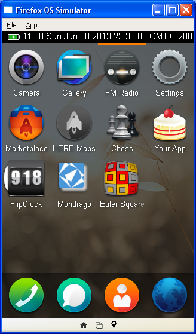
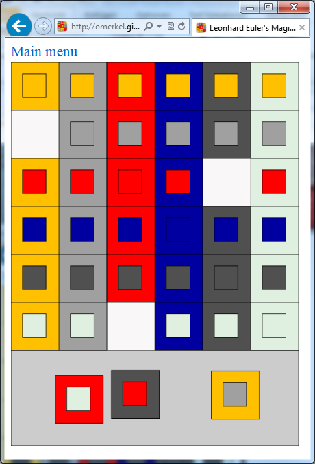
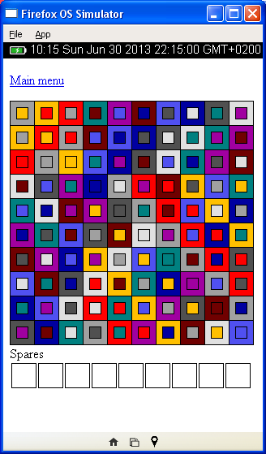
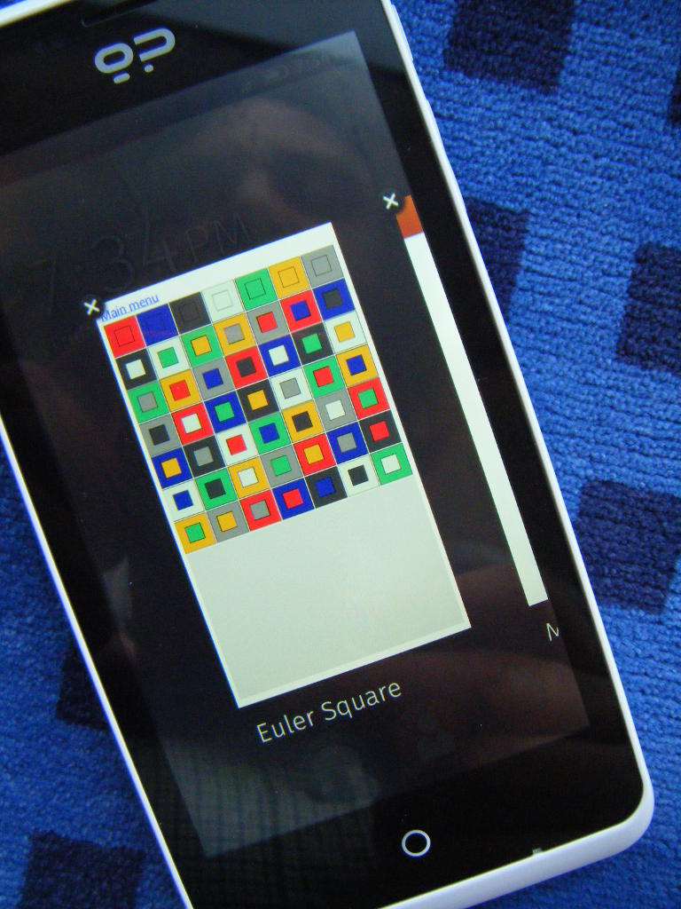
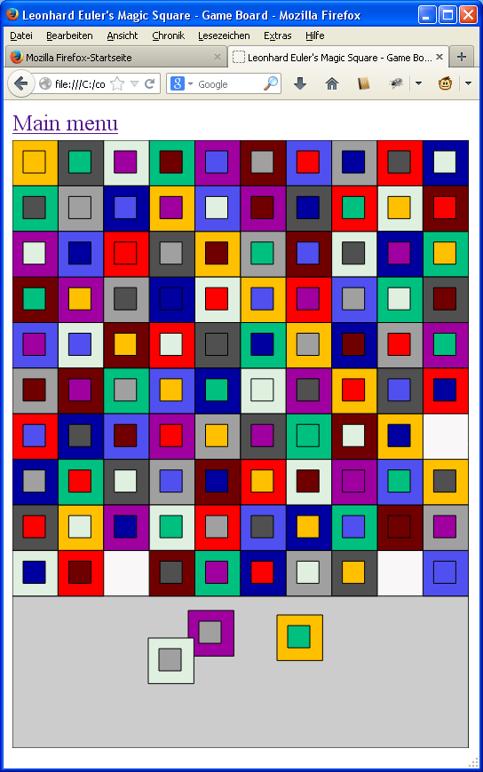

 Euler Square
====================

Leonhard Euler's Magic Square

* <em>Start an</em> <b>Euler Square</b> <em>solitaire game and solve the puzzle on your own at</em>
    * http://omerkel.github.io/eulersquare/html5/src
    * http://omerkel.github.io/eulersquare/html5/src/index_de.html (German language)

__Keywords:__ _Leonhard Euler, Euler Square, Euler'sches Quadrat,
Magic Square, Graeco-Latin square, Griechisch-Lateinisches Quadrat,
Javascript, Firefox OS, Geeksphone, Mobile device,
Catherine the Great, Katharina die Gro&szlig;e, 36 officers problem,
thirty-six officers problem, Albrecht D&uuml;rer, Melencolia &sect; I_

To get more detailed background information visit the
info page while Euler Square puzzle is running.

<table>
<tr>
<td></td>
<td></td>
</tr><tr>
<td>Application as installed in FirefoxOS (B2G), own work, Oliver Merkel,  This work is licensed under a <a rel="license" href="http://creativecommons.org/licenses/by-sa/3.0">Creative Commons Attribution-ShareAlike 3.0 Unported License</a>.</td>
<td>Euler Square application showing gameplay in MS IE10 on Win8 desktop instead of smaller resolution device, own work, Oliver Merkel,  This work is licensed under a <a rel="license" href="http://creativecommons.org/licenses/by-sa/3.0">Creative Commons Attribution-ShareAlike 3.0 Unported License</a>.</td>
</tr>
</table>

Beware: Spoiler
===============

If you still plan to solve the Euler Square puzzle on your own from scratch then do not look too closely onto the next screenshots.

<table>
<tr>
<td></td>
<td></td>
</tr><tr>
<td>Screenshot of an initial version of Euler Square in Firefox OS Simulator. This 10x10 Graeco-Latin Square has a valid 3x3 Graeco-Latin Square included, own work, Oliver Merkel,  This work is licensed under a <a rel="license" href="http://creativecommons.org/licenses/by-sa/3.0">Creative Commons Attribution-ShareAlike 3.0 Unported License</a>.</td>
<td>Euler Square of order seven on a Geeksphone Peak mobile device, own work, Oliver Merkel,  This work is licensed under a <a rel="license" href="http://creativecommons.org/licenses/by-sa/3.0">Creative Commons Attribution-ShareAlike 3.0 Unported License</a>.<td>
</tr><tr>
<td></td>
</tr><tr>
<td>Another solution sized 10x10. This solution has tiles of same inner and outer color on long diagonal only, own work, Oliver Merkel,  This work is licensed under a <a rel="license" href="http://creativecommons.org/licenses/by-sa/3.0">Creative Commons Attribution-ShareAlike 3.0 Unported License</a>.</td>
</tr>
</table>
