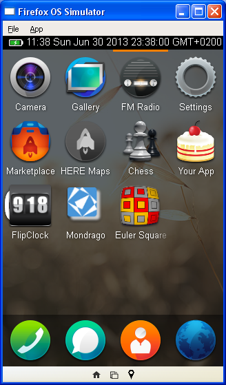
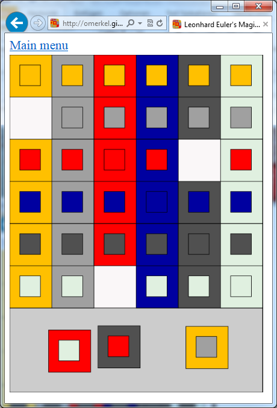
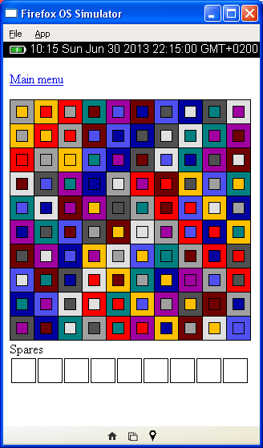
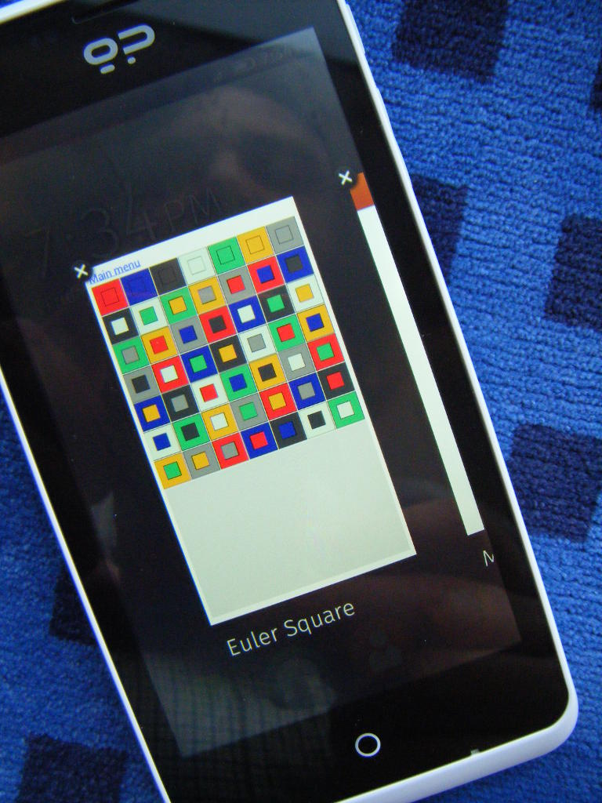
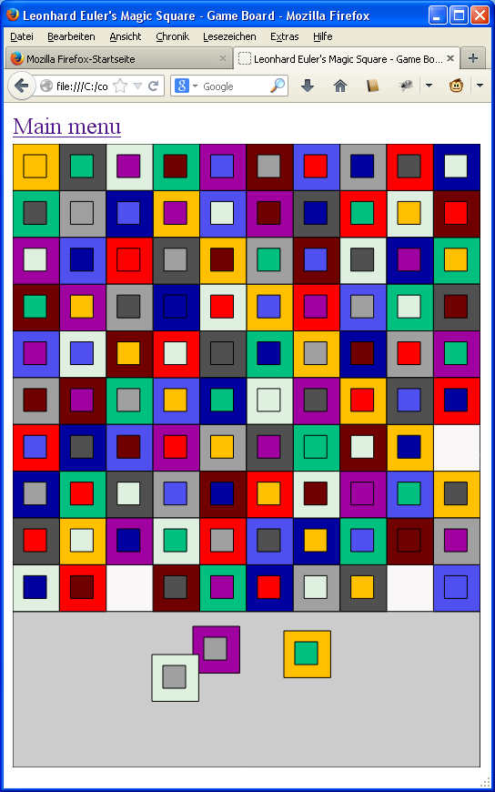

#  Euler Square

## Leonhard Euler's Magic Square

* *Start an* **Euler Square** *solitaire game and solve the puzzle on your own at*
  * [http://omerkel.github.io/eulersquare/javascript/html5/1.2/src](http://omerkel.github.io/eulersquare/javascript/html5/1.2/src)
  * [http://omerkel.github.io/eulersquare/javascript/html5/1.1/src](http://omerkel.github.io/eulersquare/javascript/html5/1.1/src)
  * [http://omerkel.github.io/eulersquare/javascript/html5/1.1/src/index_de.html](http://omerkel.github.io/eulersquare/javascript/html5/1.1/src/index_de.html) (German language)

**Keywords:** *Leonhard Euler, Euler Square, Euler'sches Quadrat,
Magic Square, Graeco-Latin square, Griechisch-Lateinisches Quadrat,
Javascript, Firefox OS, Geeksphone, Mobile device,
Catherine the Great, Katharina die Gro&szlig;e, 36 officers problem,
thirty-six officers problem, Albrecht D&uuml;rer, Melencolia &sect; I*

To get more detailed background information visit the
info page while Euler Square puzzle is running.

### Screenshots

#### Application as installed in FirefoxOS (B2G)

Own work, Oliver Merkel. Licensed under [Creative Commons Attribution-ShareAlike 3.0 Unported License](http://creativecommons.org/licenses/by-sa/3.0).

#### Euler Square application showing gameplay in MS IE10 on Win8 desktop

Own work, Oliver Merkel. Licensed under [Creative Commons Attribution-ShareAlike 3.0 Unported License](http://creativecommons.org/licenses/by-sa/3.0).

## Beware: Spoiler

If you still plan to solve the Euler Square puzzle on your own from scratch then do not look too closely onto the next screenshots.

### Gameplay Screenshots

#### Initial version in Firefox OS Simulator (10x10)

Initial version in Firefox OS Simulator. This 10x10 Graeco-Latin Square has a valid 3x3 Graeco-Latin Square included. Own work, Oliver Merkel. Licensed under [Creative Commons Attribution-ShareAlike 3.0 Unported License](http://creativecommons.org/licenses/by-sa/3.0).

#### Euler Square on Geeksphone Peak (7x7)

Euler Square of order seven on a Geeksphone Peak mobile device. Own work, Oliver Merkel. Licensed under [Creative Commons Attribution-ShareAlike 3.0 Unported License](http://creativecommons.org/licenses/by-sa/3.0).

#### Another 10x10 solution

Another solution sized 10x10. This solution has tiles of same inner and outer color on long diagonal only. Own work, Oliver Merkel. Licensed under [Creative Commons Attribution-ShareAlike 3.0 Unported License](http://creativecommons.org/licenses/by-sa/3.0).
