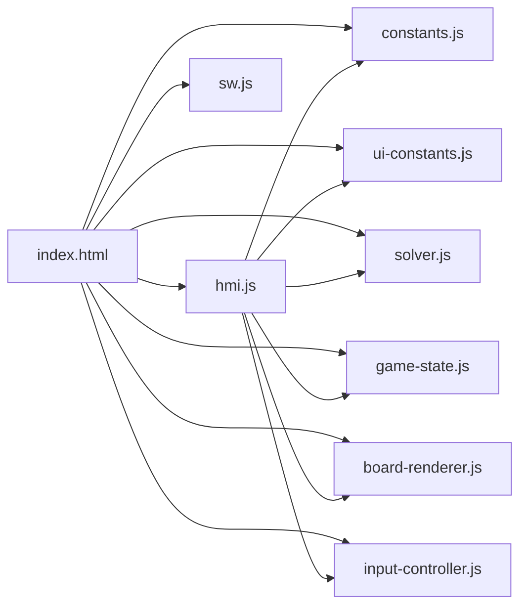
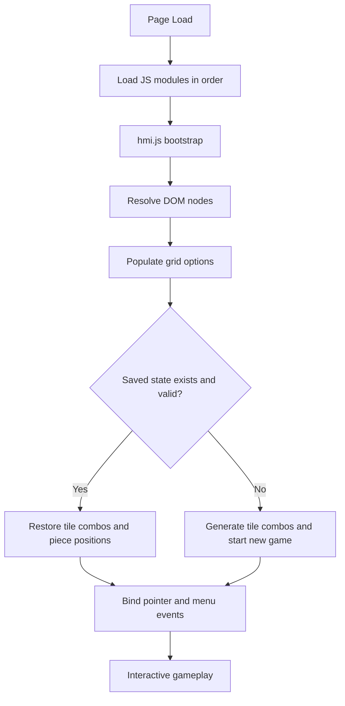
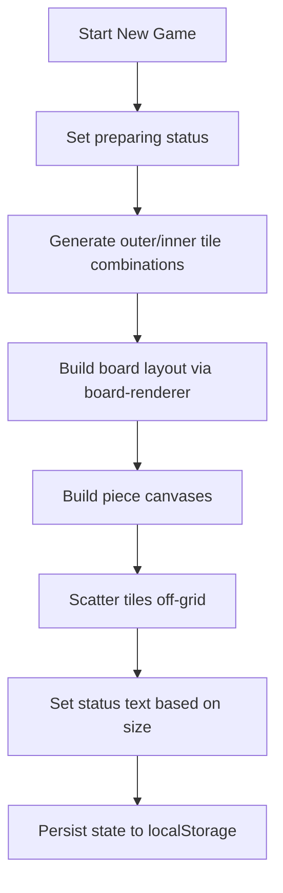
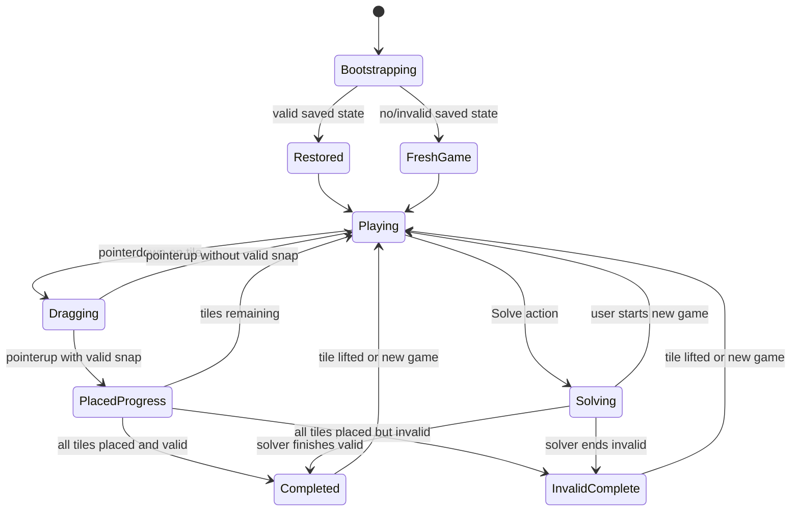
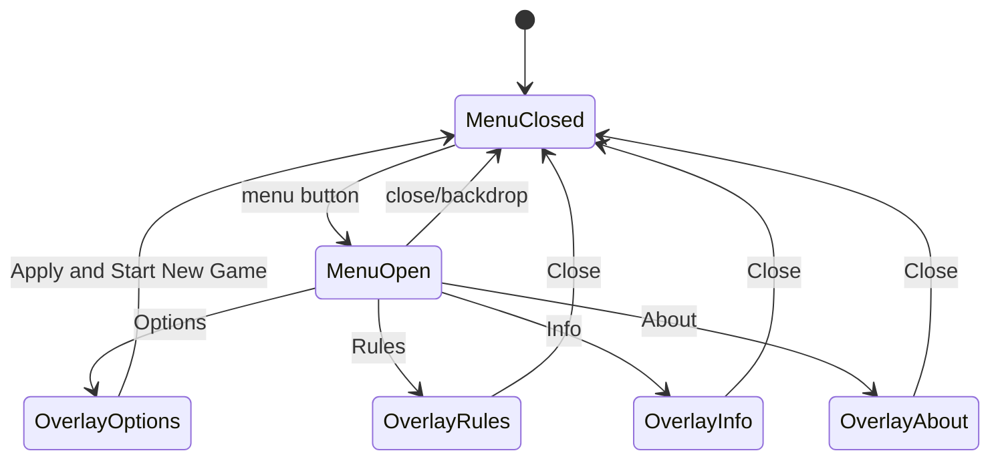
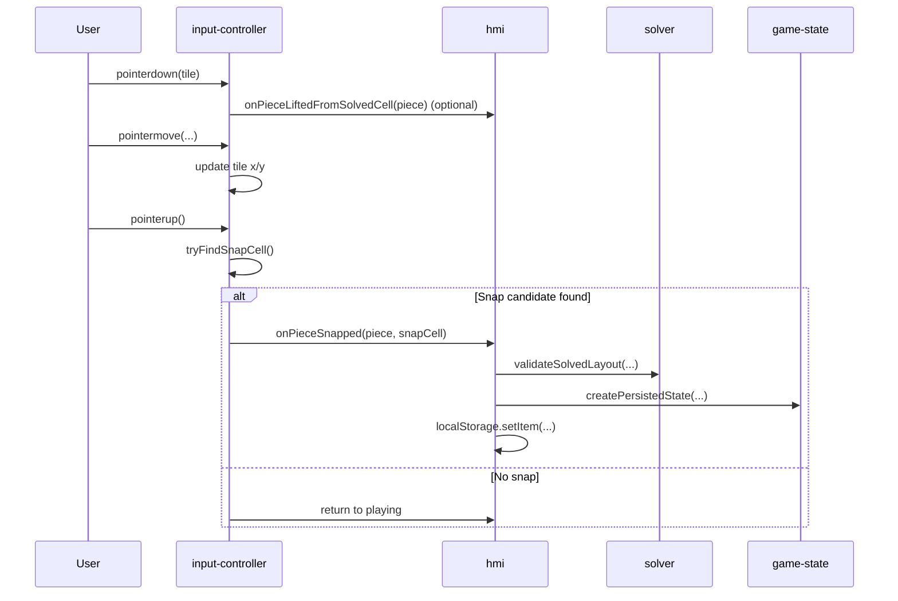
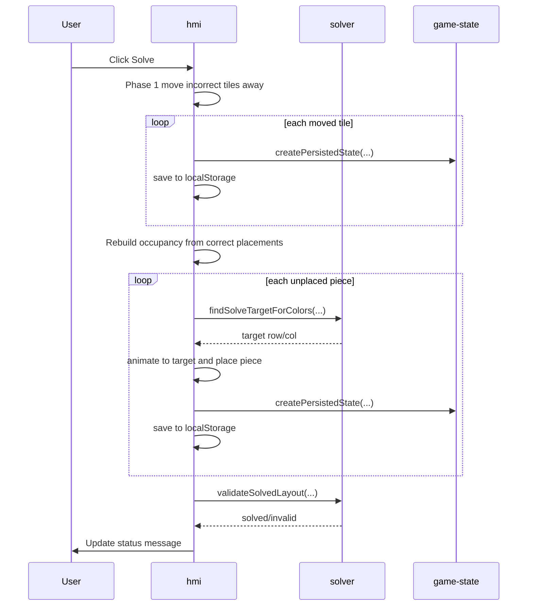
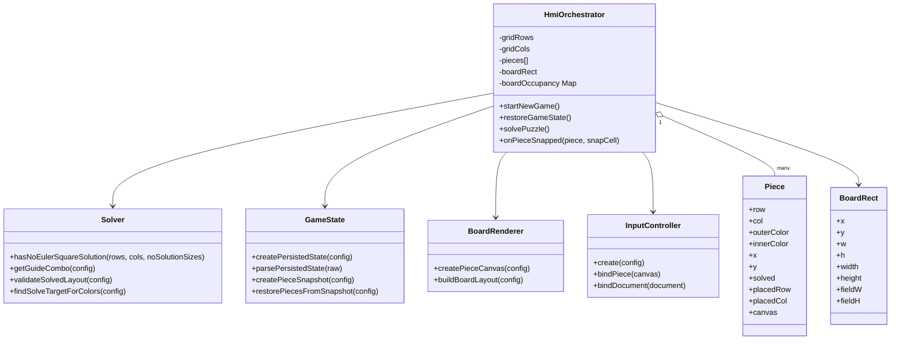
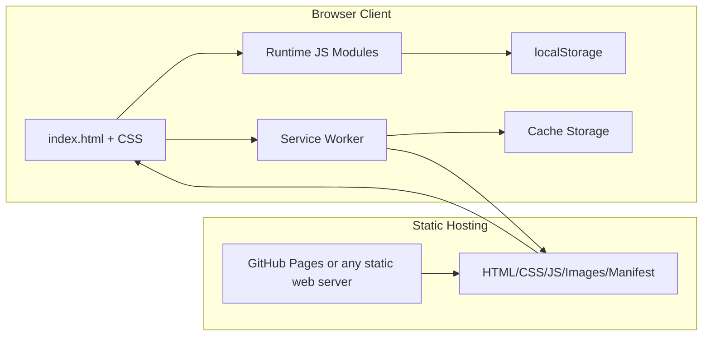
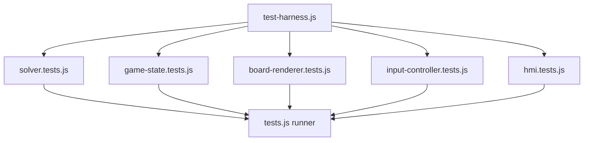

# Software Architecture

## 1. Purpose And Scope

This document describes the software architecture of the Euler Square HTML5
application in `javascript/html5/1.2/src/`.

It covers:

- Functional scope and feature set
- Runtime structure and module responsibilities
- Interaction and state behavior
- Deployment and offline/PWA behavior
- Test strategy and architectural test split
- Suggested next improvements

Target audience:

- Maintainers and contributors
- QA and test authors
- Reviewers performing architecture-level changes

## 2. System Overview

Euler Square is a client-side web application.

- UI and game logic run fully in the browser
- No backend service is required
- Persistent state is stored in browser `localStorage`
- Offline support is provided by `sw.js` (Service Worker + Cache API)

## 3. Feature List

Core features:

- Drag-and-drop tile placement using Pointer Events
- Snap-to-cell placement with occupancy checks
- Guide overlay toggle (show/hide)
- New game generation by selected board size (`1..14`)
- Auto-solver animation for supported sizes
- Rule validation (row and column uniqueness for outer and inner colors)
- State restore on reload and state-preserving resize behavior
- Side navigation and informational overlays (Options, Rules, Info, About)

Behavior nuances:

- No-solution guide indication for `2x2` and `6x6`
- Solve action currently disabled for sizes `2`, `6`, and `14`
- Tests load only in local debug hosts or when `?tests=1` is used

## 4. How To Navigate Through The Application

Main interaction path:

1. Open the app and wait for initial layout
2. Open menu (`hamburger` button)
3. Start a new puzzle with `New...`
4. Change size from `Options...` then `Apply And Start New Game`
5. Drag pieces onto board cells
6. Use `Show Guide` / `Hide Guide` as needed
7. Use `Solve` for supported sizes
8. Open `Rules`, `Info`, and `About` overlays for guidance/context

## 5. Architectural Module Split

Current runtime modules in `src/js/`:

- `constants.js`: static constants and even-order guide templates
- `ui-constants.js`: DOM ids, labels, overlay page descriptors, UI behavior
- `solver.js`: guide generation, layout validation, target search
- `game-state.js`: persistence serialization and restore snapshot logic
- `board-renderer.js`: board layout sizing and canvas rendering
- `input-controller.js`: pointer lifecycle and snap decision logic
- `hmi.js`: orchestration/bootstrap and integration glue

### 5.1 Module Dependency Diagram

## 6. Runtime Flow Charts

### 6.1 Application Startup Flow

### 6.2 New Game Generation Flow

## 7. State Charts

### 7.1 Puzzle Lifecycle State Chart

### 7.2 Overlay UI State Chart

## 8. Object Message Exchange (Sequence Diagrams)

### 8.1 Drag, Snap, Validate Sequence

### 8.2 Solve Action Sequence

## 9. Class Diagram (Conceptual)

This is a conceptual class-style model of module contracts and key data
structures.

## 10. Deployment Architecture

### 10.1 Deployment Diagram

### 10.2 PWA Cache Strategy

- Precache core runtime assets during service worker install
- Conditionally precache test assets only on local debug hosts
- Static assets: cache-first with network fallback
- Non-static/document requests: network-first with cache fallback
- Offline document fallback: `index.html`

## 11. Test Architecture

Test modules in `src/test/`:

- `test-harness.js`: registration and summary reporting
- `solver.tests.js`: domain rule/solver checks
- `game-state.tests.js`: serialization/restore checks
- `board-renderer.tests.js`: rendering/layout checks
- `input-controller.tests.js`: pointer/snap behavior checks
- `hmi.tests.js`: integration checks
- `tests.js`: runner entry point

### 11.1 Test Module Diagram

## 12. Data Model Summary

Persisted game-state payload (simplified):

- `gridRows`, `gridCols`
- `boardWidth`, `boardHeight`
- `tileCombos[row][col] = { outerColor, innerColor }`
- `pieces[]` with:
  - identity (`row`, `col`)
  - placement (`placedRow`, `placedCol`, `solved`)
  - color attributes (`outerColor`, `innerColor`)
  - relative fallback position (`relX`, `relY`) when unplaced

## 13. Quality Attributes

Primary quality goals and how architecture supports them:

- Maintainability:
  - Explicit module boundaries (solver, state, renderer, input)
- Testability:
  - Module-level tests and isolated contracts
- Performance:
  - Canvas-based rendering and incremental movement updates
- Offline resilience:
  - Service worker precache and runtime caching
- Responsiveness:
  - Board rebuild with state snapshot/restore on resize

## 14. Risks And Constraints

- Global module registration via `window.*` requires strict load ordering
- Large grid sizes increase DOM/canvas count and animation work
- Solver animation is currently sequential and may be slow on low-end devices
- LocalStorage schema is implicit (no explicit versioned migration yet)

## 15. Suggested Improvements

Recommended next steps:

1. Add schema versioning for persisted state and migration guards
2. Add optional telemetry hooks for performance timings (render/solve/restore)
3. Add accessibility pass for keyboard-only puzzle interactions
4. Add CI browser-based test runner (Playwright) for deterministic regression checks
5. Introduce ADR files in `doc/adr/` for major architectural decisions
6. Consider ES module migration to remove global `window.*` coupling

## 16. Change Impact Guidance

When modifying specific areas, expected blast radius:

- Puzzle rules or validation:
  - `solver.js`, `solver.tests.js`, status text in `ui-constants.js`
- Save/restore behavior:
  - `game-state.js`, `hmi.js`, `game-state.tests.js`
- Visual layout and tile drawing:
  - `board-renderer.js`, CSS, `board-renderer.tests.js`
- Drag/snap behavior:
  - `input-controller.js`, `hmi.js`, `input-controller.tests.js`
- Offline and caching:
  - `sw.js`, optionally test/load gating in `index.html`
